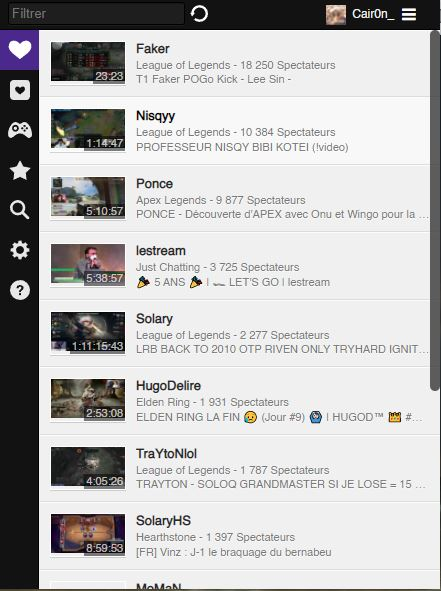
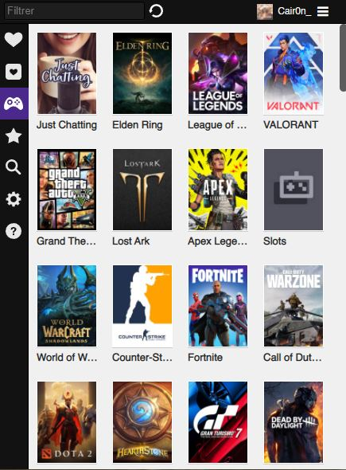
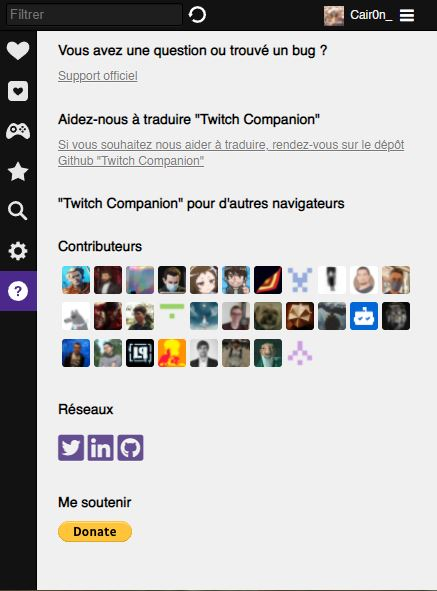
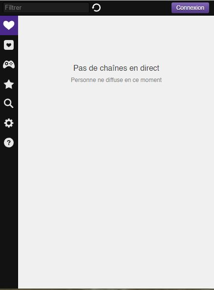

# Twitch Companion 

<p align="center">
    
</p>

[](https://github.com/LPauzies/twitch-companion/actions/workflows/codeql.yml) &nbsp; [](https://github.com/LPauzies/twitch-companion/actions/workflows/tags.yml)

## Description

Twitch companion allows you to quickly access your favorite streamers. Search streamers by games and access it directly from the extension. Twitch companion allow you to get in touch of which one of your followed streamers is going live by using popup messages (can be disabled through parameters)

The application is fully customizable through parameters tab.
The application supports multiple languages such EN, FR, ES and more.

Source code available here : https://github.com/LPauzies/twitch-companion

## Requirements

* [Node v16.14+](https://nodejs.org/en/)
* [Gulp](https://gulpjs.com/docs/en/getting-started/quick-start/)

## How to build

Before all, you need to install dependencies:
```
$ npm install
```

After you need to have a secret for the twitch application, go to your developer console and get a secret.  
Push it to `.env` file at root.
```
$ echo "TWITCH_SECRET=my-twitch-secret" > .env
```

To build every versions of the extension :
```
$ npm run build:all
```

To build a version case of browser firefox, chrome or opera :
```
$ npm run build:<browser>
```

To package every versions of the extension :
```
$ npm run package:all
```

To package a version case of browser firefox, chrome or opera :
```
$ npm run package:<browser>
```

To upgrade the version of the app :
```
$ npm run dist:all:<state> # state will be 'minor', 'medium' or 'major'
```

To clean the build, node_modules and dist :
```
$ npm run clean:all
```

To make a zip of the source code (requested by Mozilla Foundation) :
```
$ npm run compress:source
```

## Translation guide

This guide will help you to get prepared for translation. Let's start!

1.  Register your account first. 
2.  Visit the project page again and choose "Fork" option available in top-right corner. This will copy whole repository to your account.
3.  Hit plus icon to create new translation file in "_locales" directory. If your language directory does not exists yet, feel free to create one (https://developer.chrome.com/webstore/i18n#localeTable)
4.  When you're done, you can now commit and push your changes. The new files will appear on you Github account.
5.  You're almost done. The only thing left is to create a pull request so I can see that you want to apply your changes. To do it, press the "Pull request" button. Make sure, the target repository is correct and press "Send pull request"

## Application views

<p align="center">
    
    &nbsp;
    
    &nbsp;
    
    &nbsp;
    
</p>

## Fork

This app is a fork from <https://github.com/Ndragomirov/twitch-now>, thanks for the work he has done and all the contributors.